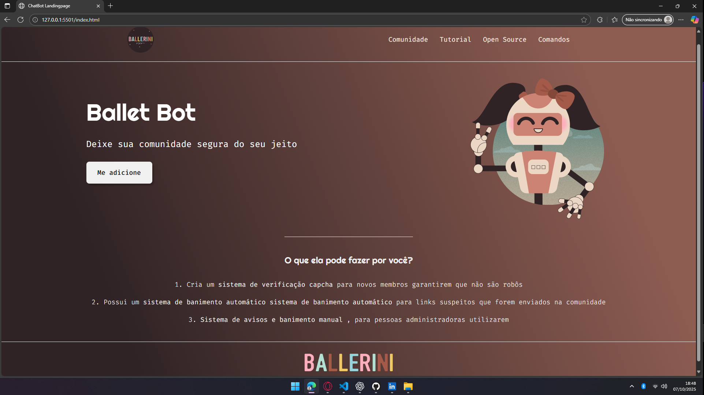

Landing Page

Projeto desenvolvido com base em um vídeo da Rafaella Ballerini, com o objetivo de praticar conceitos fundamentais de HTML e CSS, além de reforçar técnicas de layout responsivo e boas práticas de estruturação de código.

📋 Descrição

Esta landing page foi criada com foco em desenvolver uma estrutura simples, limpa e moderna.
O projeto segue princípios de responsividade e utiliza apenas tecnologias front-end puras, sem frameworks.

🧠 Objetivos de Aprendizado

- Fortalecer a base em HTML5 e CSS3
- Praticar a organização de código e separação de responsabilidades
- Trabalhar com design responsivo e boas práticas de usabilidade
- Reforçar o entendimento de estruturação semântica

🖥️ Demonstração

🧩 Tecnologias utilizadas

- HTML5
- CSS3

⚙️ Como executar o projeto
🧾 Pré-requisitos

Antes de começar, é necessário ter o Git
 instalado em seu computador.

🚀 Passo a passo

Clone o repositório:

git clone https://github.com/Caua-Sampaio/Landing-Page

Acesse o diretório do projeto:

cd NOME-DO-REPOSITORIO

Abra o arquivo index.html diretamente no navegador de sua preferência.

📚 Créditos

Projeto desenvolvido a partir do conteúdo de Rafaella Ballerini
.

👨‍💻 Autor

Cauã Sampaio
LinkedIn - www.linkedin.com/in/caua-duarte-sampaio
